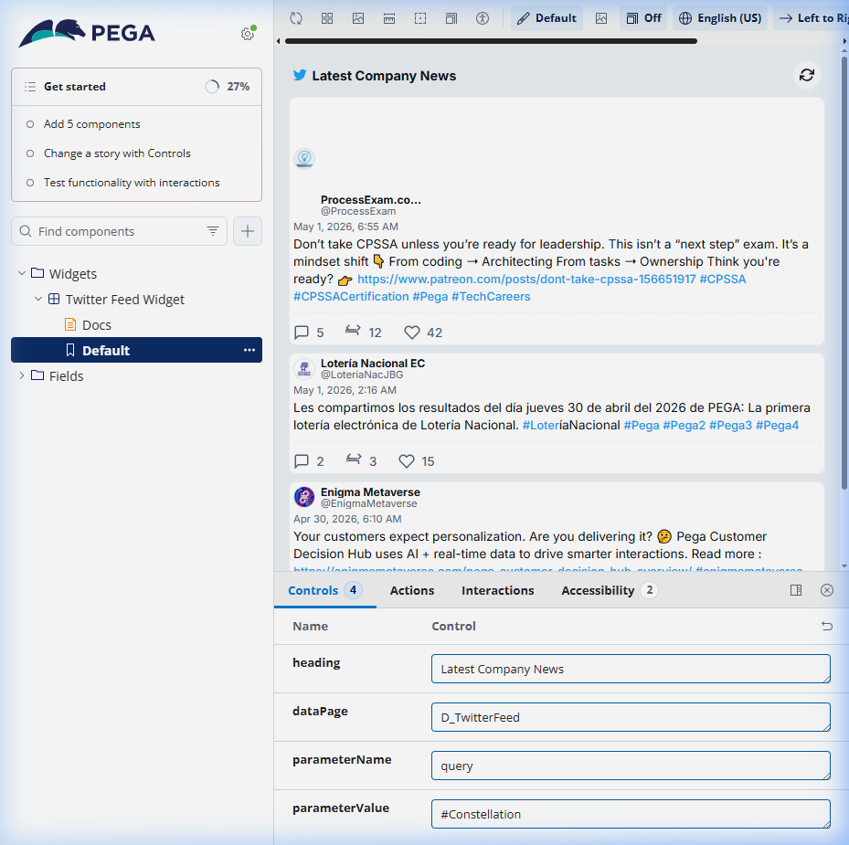
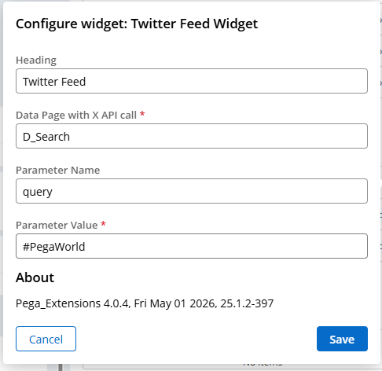
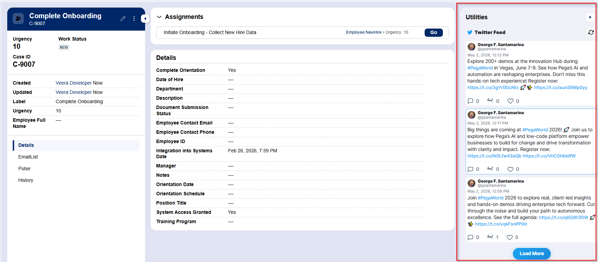
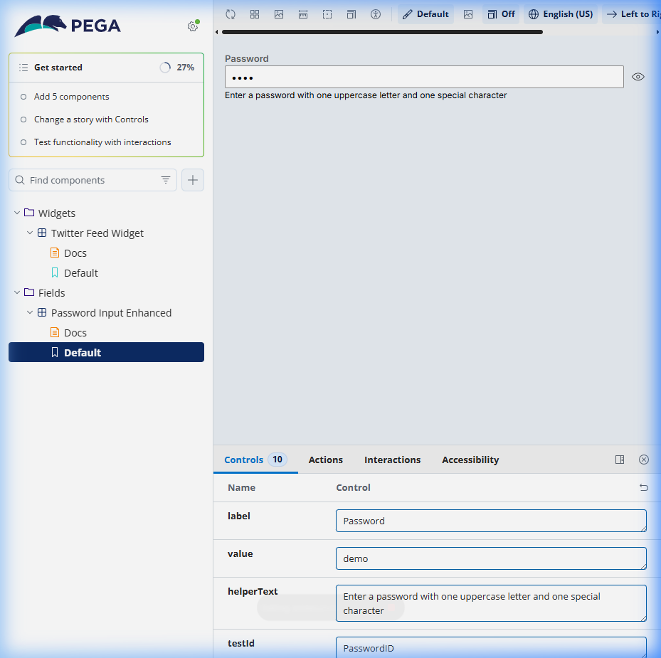

# Custom Constellation DX Gallery - Veera Kothakota

This repository contains a personalized collection of high-quality, production-ready custom components for the Pega Constellation DX environment.

Components are developed based on the source - https://github.com/pegasystems/constellation-ui-gallery

## 🚀 Active Components

### 1. Twitter Feed Widget
A modern, enterprise-grade social media integration.
- **Architecture:** Uses a secure, proxied architecture via Pega Data Pages to handle external API requests.
- **Features:** Dynamic hashtag filtering, avatar support, and live engagement metrics (likes, retweets, replies).
- **Design:** Clean, card-based interface following modern design patterns.






### 2. Password Input Enhanced
A secure text input field designed for sensitive data (passwords, SSNs, API keys).
- **Security:** Automatic masking in read-only/review modes.
- **UX:** Interactive eye-toggle to reveal plaintext.
- **Pruned:** Lightweight bundle with no unused Pega boilerplate.



## 🛠️ Getting Started

### Prerequisites
- Node.js (>= 24.4.1)
- npm (>= 11.4.2)
- Pega Infinity Server (24.1+)

### Installation
```bash
npm install
```

### Local Development (Storybook)
```bash
npm run start
```
View components in isolation at `http://localhost:6006`.

### Validation & Building
```bash
npm run validateAll
```
Ensures all components meet Pega's schema and linting requirements.

## 📦 Publishing
To publish the library to your Pega environment:
1. Configure `tasks.config.json` with your server details.
2. Run authentication:
```bash
npm run authenticate
```
3. Publish all components:
```bash
npm run publishAll
```

---
*Created and maintained by Veera Kothakota.*
